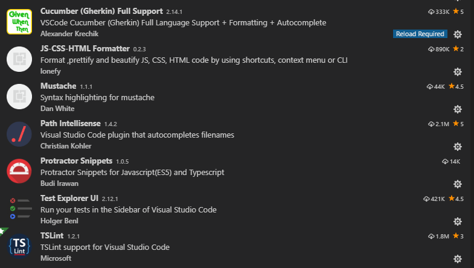

# Archer API BDD Framewok

[](http://commitizen.github.io/cz-cli/)

## Get Started

#### Pre-requisites

1.NodeJS installed globally in the system.
https://nodejs.org/en/download/

2.Install JDK (>1.8.x)

## Recommanded IDE

VSCode

## Recommanded VSCode Extensions



## Setup Scripts

- Clone the repository into a folder
- Go inside the folder and run following command from terminal/command prompt

```
npm install
```

- All the dependencies from package.json and ambient typings would be installed in node_modules folder.

## Run tests

Just run the below command

```
npm run test
```

The above command would trigger tests in chrome and generate Serenity-BDD reports automatically!

> The execution reports would be available in **target** folder

## Test Annotation

In this framework, we use 4 types of annotation to group the test cases as per our expectation.

1. @smoke - to group test cases for smoke tests [applicable to scenario & feature]
2. @regression - to group test cases for regression tests [applicable to scenario & feature]
3. @jira-epic/feature-id - [applicable to feature]
4. @jira-us-id - [applicable to scenario]

## Run tests(Browser mode)

Multiple browser configurations are available in **config/browser.config** folder and **package.json** has respective scripts to run tests in specific browsers

## Writing Features

> feature files needs to be written in test/e2e/features

```
Feature: API Testing
    As a user, I want to test demo api

    @api
    Scenario Outline: user gets valid response from api
        Given user checks api is up and running
        When  user want to get data by id="<id>"
        Then  user recieves "<response_code>" response from the api
        Examples:
            | id | response_code |
            | 1  | 403           |
            | 2  | 200           |
```


## Writing Step Functions

> UI page functions needs to be written in test/e2e/specs/stepFunctions

```ts
import * as request from 'request-promise-native';
import { expect } from 'src/support/assert/expect';
import { apiProps } from 'config/api.config';
import { logger } from 'src/utils';

let userGetResponseCode: string;

class APIMethods {
  async getPostById(id: number) {
    await request.get(apiProps.endPoint + '/posts/' + id, (error, response) => {
      if (error) {
        logger.error(error);
      } else {
        logger.info('response code:', response.statusCode);
        userGetResponseCode = String(response.statusCode);
      }
    });
    return userGetResponseCode;
  }

  async testResponse(actualStatusCode: string, expectedStatusCode: string) {
    await expect(actualStatusCode, '<--Chek api response code-->').to.be.equal(expectedStatusCode);
  }
}

export let apiMethods = new APIMethods();

```

## Writing Step Definitions

> UI page functions needs to be written in test/e2e/specs/ui/stepDefinitions

```ts
import { apiMethods } from 'test/e2e/specs/stepFunctions';
import { logger } from 'src/utils';

let actualResponseCode: string;

export = function performAPIValidations() {
  this.Given(/^user checks api is up and running$/, async () => {
    await logger.info('api is up an running');
  });

  this.When(/^user want to get data by id="(.*)"$/, async (id: string) => {
    actualResponseCode = await apiMethods.getPostById(Number(id));
  });

  this.Then(/^user recieves "(.*)" response from the api$/, async (expectedResponseCode: string) => {
    await apiMethods.testResponse(actualResponseCode, expectedResponseCode);
  });
};

```

## Cucumber Hooks

Following method takes screenshot on failure of each scenario

```ts
import { browser } from "protractor";

export= function(){
this.Before({timeout: 100 * 1000}, async function(scenario)  {
    await browser.manage().window().maximize();
    await browser.get(browser.baseUrl);
});

```

## HTML Reports

Currently this project has been integrated with Serenity-JS. Reports produced are user-friendly and BDD structured.


## Contributions

For contributors who want to improve this repo by contributing some code, reporting bugs, issues or improving documentation - PR's are highly welcome, please maintain the coding style , folder structure , detailed description of documentation and bugs/issues with examples if possible.

## License

```
RSA License

Copyright (c) 2019
```
